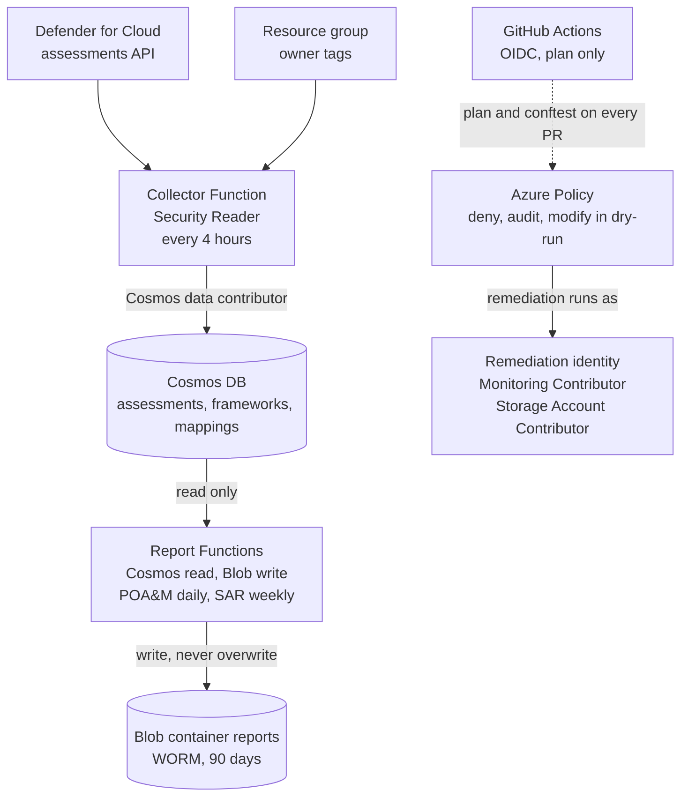

# An Azure GRC evidence pipeline, built and broken on a real subscription

[](LICENSE)


I wanted to test one idea: that compliance can run as a pipeline instead of a spreadsheet. On my own
Azure subscription, a collector pulls Microsoft Defender's findings into a Cosmos DB that I own, two
report generators turn that store into a POA&M and a SAR on timers, and an Azure Policy loop fixes
drift through one least-privilege identity while a person approves each step. All of it is Terraform,
every change was a pull request, and every claim in this README was checked against the running
subscription.

This is my capstone for **CGE-AZ: Certified GRC Engineer, Azure Specialty**
([GRC Engineering Club](https://www.grcengclub.com)). It began as a clone of the club's starter
repository, and most of what is worth reading here is what I had to find and fix after cloning it:
the starter's CI could not pass, its collector never captured severity, its report owners were
placeholders, and its POA&M IDs were not stable.

## The build in numbers

As of 2026-09-18.

| | |
|---|---|
| Terraform stages, each with its own state | 5 |
| Function Apps | 2: the collector runs every 4 hours; the POA&M runs daily at 06:00 UTC and the SAR weekly on Mondays |
| Defender assessments per sweep | 101 (40 healthy, 55 unhealthy, 6 not applicable) |
| Open findings in the POA&M | 55: 4 High, 23 Medium, 28 Low |
| Unit tests | 24 |
| CI workflows | 4 |
| How changes land | Pull requests only, with four required checks on `main` |
| Full detect, approve, fix loop run | 1, end to end |

## How it fits together

The interesting part is not the flow but who is allowed to do what. Four principals, four different
permission sets, and no shared secret anywhere.



- The collector can read Defender and write evidence, and can do nothing else.
- The reporter can read evidence and write reports, and cannot write evidence or read Defender.
- The remediation identity is the only thing that changes resources, and only storage settings under
  one management group.
- CI can plan and evaluate; it cannot apply.

## What I built, stage by stage

| Stage | What is deployed | Choices that were mine to make |
|---|---|---|
| `01-foundation` | Management group hierarchy, Log Analytics, a baseline policy initiative, the remediation identity | The deny policy has a reviewed variable for its effect, so lowering it is a plan someone reads |
| `02-activation` | Defender plan baseline (Storage and Key Vaults, on top of free posture management) and the NIST CSF 2.0 initiative | Discovery reads the tier of every plan first and reports the gap; it never touches a plan outside the baseline |
| `03-evidence-store` | Cosmos DB in East US 2, a WORM blob container, the collector in Central US | Shared keys are off, so the evidence storage accepts identity or nothing |
| `04-reporting` | The POA&M and SAR generators | They may only read the store, and a unit test fails if anyone adds a live API call |
| `06-enforcement` | A remediation policy for public blob access, in dry-run | In dry-run the assignment does not enforce; a person creates the task that makes the change |

## The remediation loop, run for real

The lab says to break your sandbox on purpose. The deny policy makes the obvious sabotage impossible,
so I first lowered it to audit with a saved Terraform plan that had exactly one change. I then made a
storage account public out of band, let the policy engine flag it as non-compliant, and created the
remediation task myself, which is the approval. The fix was written by the remediation identity, and
the Activity Log records two different callers: me for the approval, and the identity's principal for
the change. I restored the deny policy afterwards and the plan came back clean.

## What broke, and how I found it

Most of the value is in the debugging. Each row was reproduced before I changed anything.

### My workstation (Kali, a rolling release)

| Symptom | Cause | Fix |
|---|---|---|
| `az provider register` crashed with `No module named azure.mgmt.resource.resources.v2024_11_01` | A system-wide `pip install` of the Azure SDK had replaced the `azure-mgmt-resource` that the packaged `azure-cli` needs. Azure is a namespace package, so whichever version lands in site-packages wins | Azure CLI 2.90 in its own virtual environment, linked ahead on `PATH` |
| A day later, `No module named 'azure'` | The distro moved `python3` from 3.13 to 3.14. A venv symlinks to the system interpreter, so it followed and lost its packages | Pinned the venv to `/usr/bin/python3.13` |
| Terraform state locked, three separate times | A killed apply; a CI job cancelled mid-plan; and `terraform plan \| head`, which closes the pipe early and kills Terraform before it releases the lock | `terraform force-unlock` after confirming nothing was running. The rule I keep now: never pipe Terraform into `head` |

### The CI, which could not pass as shipped ([#1](https://github.com/leeclay95/cgeaz/pull/1))

Every pull request failed, and each fix exposed the next failure.

| Failure | Cause | Fix |
|---|---|---|
| Login failed with `AADSTS700213` | This repository emits an immutable OIDC subject that embeds the owner and repository IDs. The arming script creates the classic subject, so no credential ever matched | Updated both federated credentials to the ID-based subjects. Propagation across Entra takes minutes, so an early retry can still fail |
| `terraform init` failed | The workflows read `backend.hcl`, which is gitignored because it is generated per learner. A CI checkout never has it | The workflows write it from a repository variable |
| conftest failed with `rego_parse_error` | The conftest step used an unpinned action from 2021 whose OPA cannot parse `import rego.v1`, which every policy here uses | Pinned conftest 0.50.0, checked against a fixed sha256 |
| Runs failed after waiting on a state lock | The matrix cancelled sibling jobs when one failed, and a cancelled `terraform plan` orphans its lock | `fail-fast: false` and a lock timeout |

### The functions and the data

| Symptom | Cause | Fix |
|---|---|---|
| The report endpoints returned an empty HTTP 500 | On the second call in a UTC day the upload hits `BlobAlreadyExists`: the path is dated, nothing overwrites, and the container is immutable. A Linux Consumption app has no log stream, so I added Application Insights and read the exception | It is the immutability contract working. It also means a manual call collides with the timers, so I let the timers produce the reports |
| A changed schedule did not take effect after a deploy | A Python v2 Function App does not resync its trigger metadata after a zip deploy | Force `syncfunctiontriggers` |
| Every stored finding had `severity = null` ([#3](https://github.com/leeclay95/cgeaz/pull/3)) | The assessments list returns no metadata unless the request adds `$expand=metadata`. The POA&M would have rated everything Medium with a 90-day deadline, in an immutable file | Request the expansion. Stored severities now match the API exactly |
| The POA&M owner column was placeholder text ([#4](https://github.com/leeclay95/cgeaz/pull/4)) | The starter never resolved owners | Stamp the owner on each finding at collection time |
| POA&M IDs could change on regeneration | Severity was sorted as text (High, Low, Medium), the ID is the position in that order, and Cosmos does not guarantee query order | Rank severity and add a stable tie-break |
| Cosmos rejected `GROUP BY` | Cross-partition aggregates only work as `SELECT VALUE` | One `VALUE COUNT` per value |

## Decisions, and why

- **Ownership is stamped when evidence is collected, not looked up when a report renders.** Reports
  may only read the store, so the owner has to already be there. A resource group with no owner tag
  is reported as *unassigned* rather than given a default, because a hidden gap is worse than a
  visible one. Subscription-level findings have no group to carry a tag, so they take a platform
  owner set from Terraform.
- **No new permission for that.** Security Reader already includes reading resource groups, so the
  collector is exactly as narrow as before.
- **The collector runs every 4 hours** for a fresher store and a denser run history. It does not
  speed up Defender: its first assessment cycle had landed by about six hours after I enabled the plan.
- **Conftest is pinned by checksum** instead of using a marketplace action, because that step runs
  in a job that holds cloud credentials.
- **`enforce_admins` is off on `main`.** It is a one-person repository and I did not want CI breaking
  to lock me out. The cost is that the owner can bypass the required checks, and I would rather say
  so than hide it.
- **Cosmos in East US 2 and the functions in Central US.** A free account has no consumption quota in
  most US regions, and East US could not host Cosmos on the day the starter was validated.
- **Identity, not network isolation, protects the evidence store.** The free consumption plan has no
  VNet integration, so shared keys are off and every access is a role assignment.

## Controls implemented

Every row is deployed. [docs/CONTROLS.md](docs/CONTROLS.md) has the full catalogue, the reasoning, and
a blast-radius and rollback table for each enforcement policy. NIST SP 800-53 Rev. 5 identifiers are
the controls a component implements or supports; the CSF 2.0 column is the crosswalk the rubric grades.

| Control | Effect | 800-53 Rev. 5 | CSF 2.0 |
|---|---|---|---|
| `cge-deny-public-blob` | Deny public blob access at the API | AC-3, AC-4, SC-7 | PR.DS |
| `cge-require-env-tag-rg` | Audit resource groups without an `env` tag | CM-8 | ID.AM |
| `cge-dine-storage-diagnostics` | Deploy diagnostic settings if missing | AU-2, AU-12 | PR.PS, DE.CM |
| `cge-fix-public-blob` | Modify in dry-run, through one identity | CM-6, AC-3 | PR.DS, RS.MI |
| Remediation identity | One named, whitelisted, user-assigned identity | AC-2, AC-6 | PR.AA, GV.RR |
| WORM on `reports` | 90-day immutability, proven by a failed delete | AU-9, AU-11, SI-7 | PR.DS |
| Shared keys off on evidence storage | Entra identity or nothing | IA-5, AC-3, AC-6 | PR.AA |
| Collector and reporter split | Different principals, different roles | AC-5, AC-6 | PR.AA, GV.RR |
| Owner stamping (mine) | Every finding has an accountable owner | CM-8(4), CA-5 | ID.AM, GV.RR |
| Store-only reporting | Every report number reproducible from a stored query | AU-7 | ID.RA, GV.OV |
| Compliance gate | Unmergeable: public blob, shared keys, Owner or Contributor grants | CM-3, CM-4 | ID.IM, PR.PS |
| Drift detection | Does reality match code, nightly | CM-2, CM-3, CM-6 | DE.CM |
| Branch protection | Four required checks on `main` | CM-3, CM-5 | PR.PS |

## Evidence you can check yourself

- **The gate blocks a bad change.** [Pull request #2](https://github.com/leeclay95/cgeaz/pull/2) adds a public,
  shared-key storage account. Its `gate (06-enforcement)` check fails at conftest and names the rule
  and the resource; the other three pass; it was closed unmerged. The Actions history therefore
  includes three failed gate runs: two are the CI defects above and one is this deliberate block.
- **A stored number traces to the live source.** After a sweep, the status counts in the store equal
  the Defender API's, and one finding traced field by field, including its `runId` and `collectedAt`.
- **Nothing in the evidence container can be deleted.** This fails with `BlobImmutableDueToPolicy`:

```bash
EVIDENCE_SA=$(cd stages/03-evidence-store && terraform output -raw evidence_storage_account)
BLOB=$(az storage blob list --account-name "$EVIDENCE_SA" --container-name reports --auth-mode login --query "[0].name" -o tsv)
az storage blob delete --account-name "$EVIDENCE_SA" --container-name reports --name "$BLOB" --auth-mode login
```

- **The tests and the repository's own check:**

```bash
python3 -m venv .venv
.venv/bin/pip install -r functions/collect_assessments/requirements.txt -r functions/reports/requirements.txt pytest
.venv/bin/pytest tests -q
./self-check.sh
```

## Reproduce it from an empty subscription

You need an Azure subscription you own, Azure CLI 2.90 or later, Terraform 1.9 or later, Python 3.11 or
later, `conftest`, and `gh` for the CI step. [docs/SETUP.md](docs/SETUP.md) covers the account, the eight
resource providers to register, regional quotas and cost guardrails. Run the quota probe before you
start; it decides where your functions can live. On a rolling-release distro, pin your virtual
environments to an exact interpreter.

| Order | What | Where |
|---|---|---|
| 1 | Management groups, tagged resource group, auditor group, budget | [labs/01-sandbox](labs/01-sandbox) |
| 2 | Defender plan, CSF 2.0 assignment, Log Analytics and Activity Log routing, seed storage | [labs/02-toolkit](labs/02-toolkit) |
| 3 | Remote state with `bootstrap.sh`, then adopt and apply the foundation | [labs/03-foundation](labs/03-foundation), `stages/01-foundation` |
| 4 | Activation | `stages/02-activation` |
| 5 | Evidence store, then deploy the collector | [labs/04-evidence](labs/04-evidence), `stages/03-evidence-store` |
| 6 | Reporting, then deploy the report generators | [labs/05-reports](labs/05-reports), `stages/04-reporting` |
| 7 | Enforcement in dry-run, then arm CI | [labs/06-loop](labs/06-loop), `stages/06-enforcement` |

Every stage is applied the same way: read the plan, and write it to a file first.

```bash
export ARM_SUBSCRIPTION_ID=$(az account show --query id -o tsv)
export TF_VAR_owner_email=you@example.com
export TF_VAR_state_storage_account=$(grep storage_account_name labs/03-foundation/backend.hcl | cut -d'"' -f2)

cd stages/03-evidence-store
terraform init -backend-config=../../labs/03-foundation/backend.hcl
terraform plan -out=stage.plan > plan.txt 2>&1
less plan.txt
terraform apply stage.plan
```

Function code goes up as a zip with a remote build, and the trigger list needs a nudge afterwards:

```bash
cd functions/collect_assessments
zip -r /tmp/collector.zip . -x "__pycache__/*"
APP=$(cd ../../stages/03-evidence-store && terraform output -raw collector_function_app)
az functionapp deployment source config-zip --name "$APP" --resource-group rg-grc-evidence-dev \
  --src /tmp/collector.zip --build-remote true --timeout 600

SUB=$(az account show --query id -o tsv)
az rest --method POST --url "https://management.azure.com/subscriptions/$SUB/resourceGroups/rg-grc-evidence-dev/providers/Microsoft.Web/sites/$APP/syncfunctiontriggers?api-version=2023-12-01"
```

**Arming CI.** `labs/06-loop/arm-your-fork.sh` creates the app registration; you add its five values as
repository variables. If your repository uses immutable OIDC subjects, the credentials it creates will
not match what GitHub sends. Read your prefix and use it as the subject:

```bash
R=your-github-user/cgeaz
gh api "repos/$R/actions/oidc/customization/sub" --jq .sub_claim_prefix
```

The federated credential subjects are then `<prefix>:pull_request` and `<prefix>:ref:refs/heads/main`.

## License

What I wrote is released under the [MIT License](LICENSE): the collector and report changes, the
tests, the CI fixes, this README, and the control catalogue. The labs, stage skeletons and original
policy rules came from the [GRC Engineering Club](https://www.grcengclub.com) starter
([GRCEngClub/cgeaz](https://github.com/GRCEngClub/cgeaz)), which publishes no license, so this license
does not extend to them.
