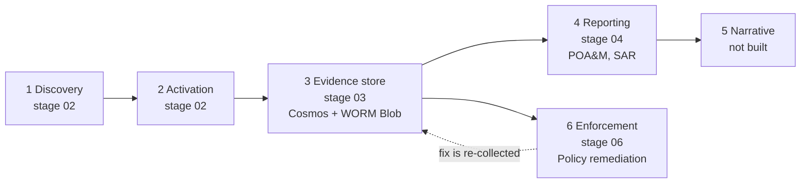

# CGE-AZ GRC Engineering Pipeline

An automated GRC engineering pipeline on Azure: it **discovers** what is running, **activates**
only what is missing, **stores immutable evidence** in a database the operator owns, **reports**
from that store alone, and **enforces** through one least-privilege identity with a human at every
escalation. Every control is code, every change is a reviewed pull request, and every report
number traces back to a stored record.

This is my capstone for **CGE-AZ: Certified GRC Engineer, Azure Specialty**
([GRC Engineering Club](https://www.grcengclub.com)). It started from the club's starter
repository ([GRCEngClub/cgeaz](https://github.com/GRCEngClub/cgeaz)) and has been extended and
corrected since. The [changes](#what-i-changed-and-fixed) and the [controls](#controls-implemented)
below say exactly what is mine and what came with the starter.



## Design rules

- **Discovers first, then acts.** Stage 02 reads what exists and enables only the measured gap.
- **Collect once.** One assessment sweep serves every framework through a crosswalk held as data.
- **Reports read the evidence store only.** No report generator calls a live platform API, and a
  unit test guards that in the source.
- **Zero stored credentials.** Managed identities inside Azure, OIDC federation in CI, shared keys
  disabled on the evidence storage. No secret exists anywhere in this repository.
- **Separation of duties.** The collector, the reporter and the remediation identity are three
  different principals with three different role sets.
- **Automation acts; humans authorize.** Escalation (audit, dry-run, enforce) is a reviewed
  parameter change, and in dry-run a person creates the remediation task.
- **Changes go through the repository.** Drift detection watches for anything that does not.

## What is deployed

| Stage | What it is | State |
|---|---|---|
| `01-foundation` | Management group hierarchy, Log Analytics, baseline policy initiative, remediation identity | applied |
| `02-activation` | Defender plan baseline driven by discovery, NIST CSF 2.0 initiative assignment | applied |
| `03-evidence-store` | Cosmos DB, WORM blob container, collector Function (every 4 hours) | applied |
| `04-reporting` | POA&M generator (daily 06:00 UTC), SAR generator (weekly, Monday 07:00 UTC) | applied |
| `06-enforcement` | Public-blob remediation policy in **dry-run** | applied |
| `05` narrative | Optional AI digest | not built |

## What I changed and fixed

Numbers are pull requests on this fork. Each was gated by CI before it merged.

1. **CI could not pass as shipped** ([#1](https://github.com/leeclay95/cgeaz/pull/1)). Three separate causes, each
   reproduced from the run logs:
   - `terraform init` in CI reads `labs/03-foundation/backend.hcl`, which is gitignored (it is
     generated per learner), so every stage failed at init on every pull request. Both workflows now
     write it from the `STATE_STORAGE_ACCOUNT` repository variable.
   - The conftest step used `instrumenta/conftest-action@master`, unpinned and last updated in 2021.
     Its bundled OPA cannot parse `import rego.v1`, which every file in `policy/` uses, so no change
     could ever pass. It now runs conftest 0.50.0, downloaded and checked against a pinned sha256.
   - The stage matrix cancelled sibling jobs when one failed. Cancelling `terraform plan` mid-run
     orphans the remote state lock, and the next run then waits out its lock timeout and fails.
     The matrix now sets `fail-fast: false` and plans use `-lock-timeout=5m`.
2. **Severity was never collected** ([#3](https://github.com/leeclay95/cgeaz/pull/3)). The Defender assessments list
   returns no `metadata` unless asked to expand it, so every stored document had `severity = null`,
   the POA&M would have rated every finding Medium with a 90-day deadline, and the SAR would have said
   "Unknown". Both reports are written to an immutable container, so a wrong report stays wrong for 90
   days. The collector now requests `$expand=metadata`, and on the live data the stored severities
   match the API exactly (High 20, Medium 32, Low 49).
3. **The POA&M owner column was a placeholder** ([#4](https://github.com/leeclay95/cgeaz/pull/4)). Ownership is
   now stamped on each finding at collection time, because reports may only read the store.
   A resource group's `owner` tag is used; a group with no tag is reported as unassigned rather than
   given a default; subscription-level findings take a platform owner set from Terraform. The
   collector needs no new permission.
4. **POA&M IDs were not stable** ([#4](https://github.com/leeclay95/cgeaz/pull/4)). Findings were sorted by severity as
   text (High, Low, Medium) and the ID is the position in that order, which Cosmos does not guarantee,
   so an ID could land on a different finding when a report was regenerated. Severity is now ranked
   with a deterministic tie-break.
5. **Tests where there were none.** 24 unit tests (`tests/`) cover the evidence path: deterministic
   document IDs, run lineage on every document, null-safe parsing, pagination, owner resolution, the
   no-overwrite contract for the immutable container, and the store-only rule. They run in CI on every
   relevant pull request and nightly.
6. **Smaller fixes.** The state resource group is now tagged with an owner by `bootstrap.sh`; lab
   evidence files (which hold subscription IDs) are gitignored by pattern; the collector schedule that
   was changed in Azure is now in the repository; provider lock files carry the CI platform checksums.

## Controls implemented

Every component below is deployed. The full catalogue, with the reasoning for each, is in
[docs/CONTROLS.md](docs/CONTROLS.md). NIST SP 800-53 Rev. 5 identifiers are the controls a component
implements or supports; the CSF 2.0 column is the crosswalk the rubric grades.

| Control | Effect | 800-53 Rev. 5 | CSF 2.0 |
|---|---|---|---|
| `cge-deny-public-blob` | Deny public blob access at the API | AC-3, AC-4, SC-7 | PR.DS |
| `cge-require-env-tag-rg` | Audit resource groups without an `env` tag | CM-8 | ID.AM |
| `cge-dine-storage-diagnostics` | Deploy diagnostic settings if missing | AU-2, AU-12 | PR.PS, DE.CM |
| `cge-fix-public-blob` | Modify (dry-run): remediate public access via one identity | CM-6, AC-3 | PR.DS, RS.MI |
| Remediation identity | One named, whitelisted user-assigned identity | AC-2, AC-6 | PR.AA, GV.RR |
| WORM policy on `reports` | 90-day immutability, proven by a failed delete | AU-9, AU-11, SI-7 | PR.DS |
| Shared keys disabled on evidence storage | Entra identity or nothing | IA-5, AC-3, AC-6 | PR.AA |
| Collector and reporter identities | Different principals, different roles | AC-5, AC-6 | PR.AA, GV.RR |
| Owner stamping (added) | Every finding carries an accountable owner | CM-8(4), CA-5 | ID.AM, GV.RR |
| Store-only reporting (guarded by test) | Report numbers reproducible from a stored query | AU-7 | ID.RA, GV.OV |
| Compliance gate (conftest) | Unmergeable: public blob access, shared keys, Owner/Contributor grants (the identity-block rule is a [known gap](#known-gaps)) | CM-3, CM-4 | ID.IM, PR.PS |
| Drift detection (scheduled plan) | Does reality match code | CM-2, CM-3, CM-6 | DE.CM |
| Branch protection | Four required gate checks on `main` | CM-3, CM-5 | PR.PS |

### Proven end to end

- **Detect, approve, fix, re-escalate.** With the deny policy lowered to audit through a saved
  Terraform plan, a storage account was made public out of band, the compliance scan flagged it
  non-compliant, a person created the remediation task, and the fix was written by the remediation
  identity and not by a human (the Activity Log shows two different callers). The deny policy was then
  restored.
- **The gate blocks a bad change.** [Pull request #2](https://github.com/leeclay95/cgeaz/pull/2) added a
  public, shared-key storage account. Its `gate (06-enforcement)` check failed at conftest, naming the
  rule and the resource; the other stages passed. It was closed unmerged.
- **Every number traces to a record.** On the live data the evidence store and the Defender API agree
  on every status count, and a single finding was traced field by field from Defender to its stored
  document, including its `runId` and `collectedAt`.
- **WORM.** Deleting a stored artifact fails with `BlobImmutableDueToPolicy`, for every identity.
- **Idempotent collection.** Repeated sweeps refresh documents in place; the container holds one
  document per assessment and resource.

The Actions history shows three failed gate runs. Two are the CI defects fixed in #1; the third is the
deliberate block on pull request #2.

## Deploy from an empty subscription

Prerequisites: an Azure subscription you own, Azure CLI 2.90 or later, Terraform 1.9 or later,
Python 3.11 or later, `conftest`, and `gh` for the CI arming step. [docs/SETUP.md](docs/SETUP.md)
covers the account, the eight resource providers to register, regional quotas, and cost guardrails.
Do it first; the quota probe matters more than it looks.

| Order | What | Where |
|---|---|---|
| 1 | Sandbox: management groups, tagged resource group, auditor group, budget | [labs/01-sandbox](labs/01-sandbox) |
| 2 | Defender plan, CSF 2.0 assignment, Log Analytics and Activity Log routing, seed storage | [labs/02-toolkit](labs/02-toolkit) |
| 3 | Remote state (`bootstrap.sh`), then adopt and apply the foundation | [labs/03-foundation](labs/03-foundation), `stages/01-foundation` |
| 4 | Activation | `stages/02-activation` |
| 5 | Evidence store, then deploy the collector | [labs/04-evidence](labs/04-evidence), `stages/03-evidence-store` |
| 6 | Reporting, then deploy the report generators | [labs/05-reports](labs/05-reports), `stages/04-reporting` |
| 7 | Enforcement in dry-run, then arm CI | [labs/06-loop](labs/06-loop), `stages/06-enforcement` |

Every stage is its own Terraform root module with its own state, applied the same way. Read the
plan before you apply it, and write plans to a file: piping `terraform plan` into `head` closes the
pipe early, kills Terraform mid-run, and leaves the state locked.

```bash
export ARM_SUBSCRIPTION_ID=$(az account show --query id -o tsv)
export TF_VAR_owner_email=you@example.com
export TF_VAR_state_storage_account=$(grep storage_account_name labs/03-foundation/backend.hcl | cut -d'"' -f2)

cd stages/03-evidence-store
terraform init -backend-config=../../labs/03-foundation/backend.hcl
terraform plan -out=stage.plan > plan.txt 2>&1
less plan.txt
terraform apply stage.plan
```

Function code is deployed as a zip with a remote build. On a Linux Consumption Python v2 app a deploy
does not always refresh the trigger list, so force a sync afterwards:

```bash
cd functions/collect_assessments
zip -r /tmp/collector.zip . -x "__pycache__/*"
APP=$(cd ../../stages/03-evidence-store && terraform output -raw collector_function_app)
az functionapp deployment source config-zip --name "$APP" --resource-group rg-grc-evidence-dev \
  --src /tmp/collector.zip --build-remote true --timeout 600

SUB=$(az account show --query id -o tsv)
az rest --method POST --url "https://management.azure.com/subscriptions/$SUB/resourceGroups/rg-grc-evidence-dev/providers/Microsoft.Web/sites/$APP/syncfunctiontriggers?api-version=2023-12-01"
```

### Arming CI on your fork

CI authenticates to Azure with OIDC federation and stores no secret. `labs/06-loop/arm-your-fork.sh`
creates the app registration, then you add its five values as repository **variables**. If your
repository uses immutable OIDC subject claims (the current default for new repositories), the
federated credentials it creates will not match what GitHub sends and login fails with
`AADSTS700213`. Read the exact prefix and use it as the credential subject:

```bash
R=your-github-user/cgeaz
gh api "repos/$R/actions/oidc/customization/sub" --jq .sub_claim_prefix
```

Federated credential subjects are then `<prefix>:pull_request` and `<prefix>:ref:refs/heads/main`.
Changes to a federated credential can take about ten minutes to reach every Entra replica, so a
retry shortly after an edit can still fail.

## Running the tests

```bash
python3 -m venv .venv
.venv/bin/pip install -r functions/collect_assessments/requirements.txt -r functions/reports/requirements.txt pytest
.venv/bin/pytest tests -q
./self-check.sh
```

## How the repository protects itself

| Workflow | Trigger | What it does |
|---|---|---|
| `compliance-gate` | pull request | Terraform validate and plan for four stages, then conftest on each plan. Required on `main`. |
| `drift-detection` | nightly 08:00 UTC | `terraform plan -detailed-exitcode` for four stages; opens an issue on drift. |
| `unit-tests` | pull request and nightly | Runs the 24 unit tests, no cloud credentials. |
| `guide-ci` | pull request and nightly | Parses every code block and checks every relative link in the guides. |

## Layout

```
stages/     one directory per pipeline stage, each a Terraform root module with its own state
functions/  the collector and the report generators (Python, timer-triggered, managed identity)
tests/      unit tests for the evidence path
policy/     OPA rules that gate this repository's own changes
labs/       the lab guides and helper scripts
docs/       setup, control catalogue, rubric, validation log
.github/    the compliance gate, drift detection, unit tests and guide checks
```

## Known gaps

Not built yet, so not claimed above:

- No Azure Policy control of my own beyond the starter's. The next ones are built from 800-53:
  shared-key authentication (IA-5), minimum TLS (SC-8), and blob access logging (AU-2, AU-12).
- No activity-log tripwire for "who is touching reality"; drift detection currently answers only
  "does reality match code".
- The `mappings` container that holds the framework crosswalk is not yet populated.
- `policy_identity.rego` never fires: a missing block appears in plan JSON as `identity: []`, and in
  Rego `not []` is false. A tested fix exists and is not yet applied.
- The Terraform state storage account still allows shared-key access.
- Function invocation history is not queryable (no Application Insights).
- Static analysis (`checkov`) reports findings, mostly network isolation and customer-managed keys
  that a free-tier consumption deployment cannot use; each will be fixed or documented as an
  accepted risk.
- The pipeline's run history began on 2026-09-18 and accumulates from there.

## Credits

The starter, the labs and the course are by the [GRC Engineering Club](https://www.grcengclub.com).
The rubric this repository is measured against is in [docs/RUBRIC.md](docs/RUBRIC.md).
